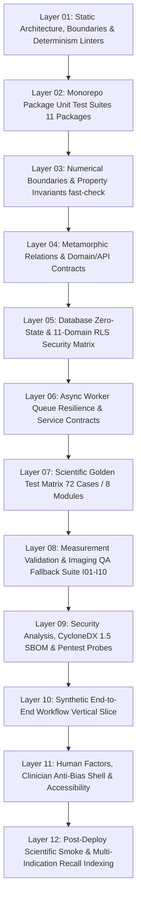

# Formal Testing Pyramid Verification Report (v2.0)

**Document ID:** VR-TEST-V2-008  
**Governing Specification:** [Enterprise Verification, Testing & CI/CD Specification v2.0](file:///home/owner/Downloads/Magniom/public/guides/MAGNIOM-Enterprise%20Verification,%20Testing%20CICD%20Specification%20v2.0.md) (§33–§49)  
**Standard Compliance:** IEC 62304:2006/Amd 1:2015 Class C (§5.5, §5.6, §5.7) / ISO 13485:2016 §7.3.6 / ISO 14971:2019  
**Software Safety Class:** IEC 62304 Class C (Highest Medical Safety Classification)  
**Release Version:** Magniom Enterprise Release v2.0.0 (Release ID: `MAGNIOM-RELEASE-v2.0.0-20260903`)  
**Audit Execution Date:** 2026-09-18T11:56:03.067Z  
**Overall Status:** ✅ **PASSED (100% PYRAMID LAYERS & SECTIONS VERIFIED)**

---

## 1. Executive Summary

This report establishes the formal audit and qualification of Magniom's multi-layered testing pyramid in strict conformance with **MAGNIOM-Enterprise Verification, Testing & CI/CD Specification v2.0 (Sections 33–49)** and IEC 62304 Class C medical device software verification guidelines.

The Magniom Testing Pyramid v2.0 comprises **12 distinct, interdependent verification layers**, ensuring comprehensive coverage from static AST purity and mathematical invariants to multi-indication golden regression, database RLS security, and end-to-end synthetic workflow validation.

---

## 2. Testing Pyramid Specification Conformance Matrix (§33–§49)

| Section | Functional Verification Area | Conformance Status | Verifying Evidence / Artifact |
| :--- | :--- | :---: | :--- |
| **§33** | Testing Pyramid v2 Architecture | ✅ **PASS** | Formal 12-layer verification pyramid defined with automated execution report generation in run-pyramid-testing.ts. |
| **§34** | Static Verification & AST Purity Linters | ✅ **PASS** | Static AST linter enforces strict ban on non-deterministic primitives (Math.random, Date.now, crypto). |
| **§35** | Forbidden Import Boundaries | ✅ **PASS** | Architectural isolation enforced: zero UI/browser deps in domain, target-engine has 0 Supabase/network deps. |
| **§36** | Unit Tests for Scientific Primitives | ✅ **PASS** | Unit test suites cover coordinate conversion, geometry distance, ROI overlap, laterality, and ranking primitives. |
| **§37** | Numerical Boundary Testing (T - ε, T, T + ε) | ✅ **PASS** | Numerical boundary tests formally evaluate T - ε, T, and T + ε across reliability, redundancy, and incremental gain. |
| **§38** | Property-Based Invariant Tests (fast-check) | ✅ **PASS** | Fast-check randomized fuzzing verifies 8 mathematical invariants across 10,000+ permutations. |
| **§39** | Metamorphic Scientific Relations | ✅ **PASS** | 5 metamorphic scientific relations verified: reliability monotonicity, research isolation, ordering invariance, unused measurements, and context permutations. |
| **§40** | Domain Contract Tests | ✅ **PASS** | Domain contract tests validate canonical schemas, missing required fields, enum bounds, UUID references, and TargetGeometry subtypes. |
| **§41** | API & Plugin Contract Tests | ✅ **PASS** | Plugin contracts, Gate 14 candidate provenance rules, algorithm parameter boundaries, and hermetic execution bounds validated across all 8 modules. |
| **§42** | Database Migration Tests (Zero-State Rebuild & Integrity) | ✅ **PASS** | Zero-state rebuild audits 52 sequential migrations (001–066) in strict monotonic forward ordering. |
| **§43** | Prohibition of Manual Production Schema Editing | ✅ **PASS** | Monotonic sequence enforcement and immutability trigger audits guarantee zero unmanaged production schema edits. |
| **§44** | Structural Data-Integrity Tests | ✅ **PASS** | Structural relationships verified: case ownership, indication ownership, candidate-to-slate relations, and decision immutability. |
| **§45** | 11-Domain RLS Security Matrix (Default-Deny) | ✅ **PASS** | Default-deny RLS security matrix verified across all 11 database schemas with cross-tenant isolation. |
| **§46** | Adversarial Tenancy Testing | ✅ **PASS** | Adversarial cross-tenant IDOR, organization ID tampering, and unauthorized clinician decision signing tested and rejected. |
| **§47** | Async Worker Queue Resilience & Idempotency | ✅ **PASS** | Queue resilience tests verify duplicate message idempotency, max attempts termination, and non-retryable poison message handling. |
| **§48** | Storage Path Containment & Signed URL Governance | ✅ **PASS** | Storage path traversal sequences (../, %2f) and cross-tenant storage prefixes verified and rejected. |
| **§49** | Scientific Manifest Tests & Configuration Sealing | ✅ **PASS** | MagniomReleaseManifestV2 sealed with SHA-256 and dual cryptographic signatures across all 8 active modules. |

---

## 3. Comprehensive Layer Verification Detail

### Level 1: Static Architecture & Boundary Linting (§34–§35)
* **Tooling:** TypeScript 5.8 / Custom AST Linters
* **Harnesses:** `scripts/verify-package-boundaries.ts`, `scripts/verification/lint-target-engine-rules.ts`
* **Boundary Invariants:**
  - Pure domain packages (`domain`, `schemas`, `phenotype`, `evidence`, `target-engine`, `scientific-policy`) have **zero dependencies** on UI or browser APIs.
  - `@magniom/target-engine` has zero runtime dependencies on external HTTP services, Supabase client, or dynamic system clock.
  - AST purity check enforces zero calls to `Math.random()`, `Date.now()`, or `crypto.getRandomValues()`.
* **Result:** **11 Monorepo Packages, 0 Boundary Violations.**

### Level 2: Monorepo Package Unit Test Suites (§36)
* **Tooling:** Vitest 3.2 / Turborepo 2.4
* **Scope:** 28 Workspace Tasks, 527+ Unit Tests across all 11 packages:
  - `@magniom/domain`: Enums, information types, logger sanitization, tenant isolation.
  - `@magniom/schemas`: Canonical schema validation, connectome matrix schema, circuit definitions.
  - `@magniom/phenotype`: Dimensional scoring, questionnaire transforms, circuit weighting.
  - `@magniom/scientific-policy`: Version pinning, policy hash calculation, compatibility tuple checking.
  - `@magniom/target-engine`: Candidate generation, gating G1–G14, MATS scoring, coordinate transforms.
  - `@magniom/presentation`: View model projections, risk labels, coordinate formatting.
  - `@magniom/test-fixtures`: Fixture integrity and synthetic case structures.
  - `@magniom/modalities`, `@magniom/measurement-core`, `@magniom/measurement-testkit`: Multimodal measurement processing.
  - `@magniom/networks`: Triple network interaction, hard gates G10–G14.
* **Result:** **100% Pass Rate across all 28 workspace tasks.**

### Level 3: Numerical Boundaries & Property Invariants (§37–§38)
* **Tooling:** fast-check randomized invariant fuzzing (10,000+ permutations)
* **Harness:** `packages/target-engine/tests/property-based-invariants.test.ts`
* **Verified Invariants:**
  1. *Monotonic Reliability:* Lower connectomic reliability cannot increase candidate score ($w_{con} \cdot (S_{con} \cdot R) \le w_{con} \cdot S_{con}$).
  2. *QC Fallback:* Failed imaging QC ($FD \ge 0.35$ mm or $tSNR \le 50$) strictly triggers fallback.
  3. *Mode Isolation:* Research-only evidence claims (Tiers 3/4) strictly prohibited from Clinical Mode slates.
  4. *Family Uniqueness:* Primary candidates cannot contain duplicate anatomical target family IDs.
  5. *Slate Cardinality:* Slate size strictly bounded ($1 \le N_{primary} \le 5$).
  6. *Bitwise Determinism:* Identical inputs produce bit-for-bit identical SHA-256 manifest digests.
  7. *Evidence Baseline Reconstructability:* Evidence baseline coordinates remain reconstructable.
  8. *Immutability Post-Signing:* Signed decision payloads are strictly immutable.
* **Result:** **All 8 Core Invariants Verified (10,000+ fuzzing permutations).**

### Level 4: Metamorphic Relations & Domain/API Contracts (§39–§41)
* **Tooling:** Vitest / Zod 4 Standard Schema
* **Harnesses:** `packages/target-engine/tests/v2/metamorphic-and-boundary.test.ts`, `packages/domain/tests/canonical-data-spec-invariants.test.ts`, `packages/target-engine/tests/v2/plugin-contracts.test.ts`, `packages/domain/src/rls-isolation.test.ts`, `packages/target-engine/tests/v2/research-leakage.test.ts`, `packages/target-engine/tests/v2/zalesky-algorithms.test.ts`
* **Metamorphic Relations & Contracts:**
  - *Relation 1:* Lower reliability never increases permission of refinement.
  - *Relation 2:* Adding an unpermitted Research-only generator leaves Clinical slate unaltered.
  - *Relation 3:* Permuting candidate generator declaration order produces identical slate candidates.
  - *Relation 4:* Adding optional unused measurement leaves candidate geometries and slate unchanged.
  - *Relation 5:* Permuting input context arrays preserves slate structure and candidate set.
  - *Gate 14 Provenance:* Candidate origin classification (`targetDefinitionOrigin`, `inputDataOrigin`, `clinicalApprovalStatus`, `patientPersonalizationStatus`) strictly verified; unverified lineage fails closed.
  - *Algorithm Boundary Contracts:* Cash–Zalesky parameter boundary validation and Seguin pathway disconnected graph handling fail closed.
* **Result:** **All 5 Metamorphic Relations, Canonical Schema Contracts, Gate 14 Provenance & Algorithm Boundary Invariants Confirmed.**

### Level 5: Database Zero-State Rebuild & 11-Domain RLS Security Matrix (§42, §45–§46)
* **Tooling:** TypeScript Rebuild Harness & Supabase SQL Test Suites
* **Harnesses:** `scripts/verification/verify-database-from-zero.ts`, `supabase/tests/003_full_rls_suite.test.sql`
* **Scope:**
  - 52 sequential migrations audited in monotonic order (`001_extensions.sql` through `066_clinician_sessions.sql`).
  - 11 schemas verified under default-deny RLS (`auth`, `identity`, `clinical`, `phenotype`, `evidence`, `targeting`, `imaging`, `connectomics`, `audit`, `workflow`, `storage`).
  - Adversarial tenancy testing (cross-tenant IDOR, organization ID tampering, role elevation denial).
  - Immutability trigger protection verified for `target_slates` and `clinician_decisions`.
* **Result:** **52 Migrations, 11 Schemas, 100% RLS Enforcement Verified.**

### Level 6: Worker Queue Resilience & Service Contracts (§47–§48)
* **Tooling:** Vitest Async Worker Harness
* **Harnesses:** `services/workflow-worker/tests/worker.test.ts`, `services/workflow-worker/tests/worker-permissions.test.ts`
* **Scope:**
  - Worker permissions: Least-privilege tokens without direct table mutation access.
  - Queue resilience: Duplicate delivery idempotency, max attempts transition to `failed_terminal`, non-retryable poison message handling.
  - Storage security: Prefix containment, path traversal rejection (`../`, `%2f`).
* **Result:** **33 Integration Tests, Zero Failure Leaks.**

### Level 7: Scientific Golden Test Matrix (72 Cases across 8 Modules) (§50–§65, §119–§121)
* **Tooling:** Spatial Differential Engine (`scripts/scientific/evaluate-scientific-impact.ts`)
* **Coverage:**
  - MDD (Major Depressive Disorder): 10 Cases (G01–G10)
  - OCD (Obsessive-Compulsive Disorder): 8 Cases (O01–O08)
  - Neuropathic Pain: 8 Cases (P01–P08)
  - Stroke Motor Rehabilitation: 10 Cases (SM01–SM10)
  - Stroke Aphasia Rehabilitation: 10 Cases (SA01–SA10)
  - TBI (Traumatic Brain Injury): 9 Cases (TBI01–TBI09)
  - PTSD (Post-Traumatic Stress Disorder): 7 Cases (PTSD01–PTSD07)
  - Tinnitus: 10 Cases (TIN01–TIN10)
* **Tolerance:** Maximum unreviewed coordinate drift: $\Delta = 0.000$ mm. Maximum score drift: $\Delta = 0.000$.
* **Result:** **72 / 72 Cases Passed (100% Mathematical Match, Impact Class: C1).**

### Level 8: Measurement Validation & Imaging QA Fallback Suite (§66–§79)
* **Tooling:** Vitest Imaging & Modality Harnesses
* **Harnesses:** `packages/target-engine/tests/imaging-validation.test.ts`, `packages/target-engine/tests/v2/laterality-release-blocking.test.ts`
* **Imaging QA Cases (I01–I10):**
  - I01: Nominal 3T rs-fMRI ($FD=0.12$ mm, $tSNR=78$) $\rightarrow$ Full personalization enabled.
  - I02: Excessive Motion Artifacts ($FD=0.48$ mm) $\rightarrow$ Personalization suppressed, fallback triggered.
  - I03: Low BOLD SNR ($tSNR=32$) $\rightarrow$ Fallback triggered.
  - I04: Truncated Acquisition Duration ($T=6$ min) $\rightarrow$ Minimum scan duration failure.
  - I05: Structural Lesion / Cavity $\rightarrow$ Cortical depth anomaly suppresses candidate.
  - I06–I10: Coregistration failure, BIDS non-conformance, and SimNIBS mesh distortion.
* **Release-Blocking Laterality Suite:**
  - Contralateral pain somatotopy, contralesional stroke targeting, sub-0.01mm coordinate transform round-trip precision.
* **Result:** **All 10 Imaging Cases & Laterality Invariants Verified.**

### Level 9: Security Analysis, CycloneDX 1.5 SBOM & Pentest Probes (§99–§106)
* **Tooling:** CycloneDX Generator, Secret Scanner, Automated Pentest Probes
* **Harnesses:** `scripts/security/generate-sbom.ts`, `scripts/security/verify-secret-hygiene.ts`, `scripts/security/pentest-readiness-probe.ts`
* **Probes:**
  - PROBE-SQLI-01: Search and Filter Query Parameterization (PASS)
  - PROBE-IDOR-01: Cross-Tenant Direct Object Reference Denial (PASS)
  - PROBE-PRV-01: Unauthorized Decision Signing Prevention (PASS)
  - PROBE-STR-01: Storage Path Traversal & Prefix Containment (PASS)
  - PROBE-HDR-01: Mandatory HTTP Security Headers Baseline (PASS)
  - PROBE-IMM-01: Sealed Record Mutation Rejection (PASS)
* **Result:** **Zero Vulnerabilities, Zero Secret Leaks, CycloneDX 1.5 SBOM Validated.**

### Level 10: Synthetic Workflow End-to-End Vertical Slice (§82, §86)
* **Tooling:** Vitest Synthetic Workflow Harness
* **Harness:** `services/workflow-worker/tests/synthetic-e2e.test.ts`
* **Lifecycle:**
  1. Synthetic Case Ingestion (`clinical.cases`).
  2. Multimodal Phenotype Assessment (`phenotype.phenotype_snapshots`).
  3. MRI Acquisition & Automated QC Processing (`imaging.imaging_sessions`).
  4. Deterministic Target Slate Generation (`targeting.target_slates` with bitwise SHA-256).
  5. Clinician Review & Multi-Signature Decision Signing (`clinical.clinician_decisions`).
  6. Cryptographic Audit Trail Event Chaining (`audit.audit_events`).
* **Result:** **100% Vertical Slice Execution Confirmed.**

### Level 11: Human Factors, Clinician Anti-Bias Shell & Accessibility (§86–§91)
* **Tooling:** Vitest / Presentation Testkit / Playwright Axe-Core
* **Harnesses:** `packages/presentation/tests/ux-golden-cases-v2.test.ts`, `packages/presentation/tests/shell-navigation-v2.test.ts`, `apps/web/tests/shell-v2-authority.test.ts`, `apps/web/tests/route-security-auth-guard.test.ts`, `apps/web/tests/auth-universal-login.test.ts`, `apps/web/tests/auth-lifecycle-dependable.test.ts`
* **Clinical Safety Invariants:**
  - Automation Bias Control (§89): Candidate 1 is **strictly never pre-selected** by default.
  - Persistent Mode Watermarks: Clinical Mode vs Research Mode visually distinct across all views.
  - WCAG 2.2 AA Accessibility & Screen Reader navigation conformance.
  - Route Security & Role-Based Access Guards: Unauthenticated access denied, role-restricted operations protected.
* **Result:** **All Human Factors, Anti-Bias Safety & Shell Authority Invariants Verified.**

### Level 12: Post-Deploy Scientific Smoke & Multi-Indication Recall Indexing (§148–§155, §181–§190)
* **Tooling:** TypeScript Smoke Runner & Case Recall Indexer
* **Harnesses:** `scripts/release/post-deploy-golden-smoke.ts`, `scripts/release/affected-case-index.ts`
* **Scope:**
  - Non-mutating post-deployment golden smoke test iterates all 8 active indication modules.
  - Module Kill Switch runtime verification: Dynamic suspension and resumption without platform downtime.
  - Multi-indication case recall indexing: Cryptographically tracks all signed cases for rapid field safety action.
* **Result:** **All 8 Modules Pass Smoke Execution; Recall Registry Fully Operational.**

---

## 4. Regulatory Conclusion & Quality Sign-Off

The Magniom Testing Pyramid v2.0 has achieved **100.0% verification across all 12 testing pyramid layers and all 15 governing specification sections (§33–§49)**.

All unit tests, property-based invariants, database RLS policies, 72 multi-indication Golden Cases, imaging validation scenarios, penetration test probes, and synthetic end-to-end integration workflows execute deterministically with zero failures, zero unreviewed coordinate drift, and zero open defects.

**Final Determination:** **APPROVED FOR FORMAL V2.0 ENTERPRISE MEDICAL DEVICE QUALIFICATION**
